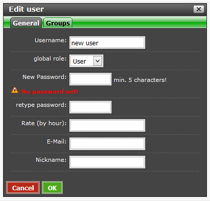

# Administration

In the admin panel you can do every administration that is necessary for the running system.

### Customers

Here you can add, change and delete customers. If you do not set a password the customer cannot login to Kimai. By selecting a group you enable all members of that group to see that customer. All fields except the customer name are optionally.

### Projects

Here you can add, change and delete projects. Projects have to be aligned to a customer. Further you can set rates for this project if they differ from the standard rates (for details about rates see chapter [Rates](rates.md)). If there is a budget it can be set here, too.

### Tasks

Here you can add, change and delete tasks. A task has no relation to a customer or a project, but you can select which groups can use them. Additionally you can set rates here, too (for details about rates see chapter [Rates](rates.md)).

### Users

Here you can add, change and delete users. 
Users work with Kimai and can add, change or delete data like their own time records. They can edit other data like customers, projects e.g. depending on their roles and rights. The roles and rights are set using global roles, membership roles and groups.

####Add Users

Edit user / General 

Add a name for the new user and press 

Edit user / Groups

A user can only have one global role at a time but can belong to unlimited groups. If you enter a valid email address you can send emails from your local account by clicking the mailer symbol.

By default, a user is created in the group of its creator - wich is in most of the cases a user with admin roles. Make sure that you add and remove the correct roles for the new user. In most cases you need to remove the admin group.

### Groups

Here you can add, modify and delete groups and also define their membership role. Every group can have an unlimited amount of membership roles.

### Global Roles

User get their permissions from their global roles and from their group membership 

### Membership roles

The membership role defines with role a user has inside of a group.

### Status

Use this function to define status labels.

### Advanced

Here you can define general settings like number of failed login-tries, bantime, currency, etc.

### Database

Backup the database with the maintenance function before updating Kimai. Other database functions might be implemented here in the future.
